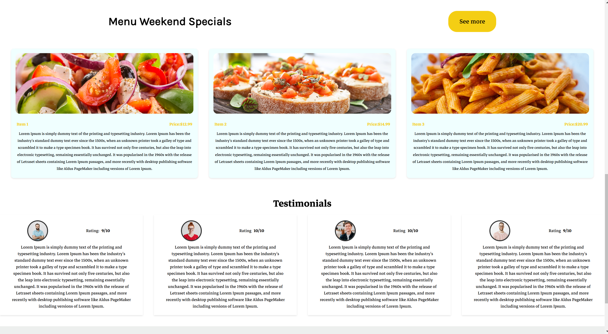
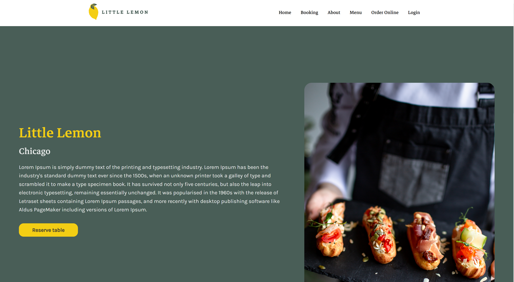
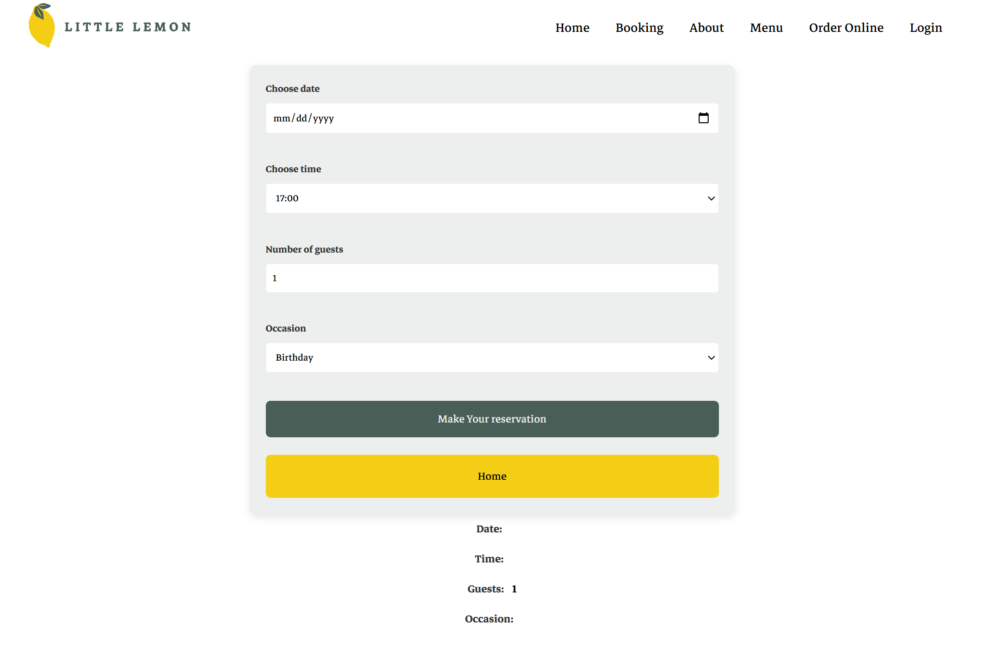
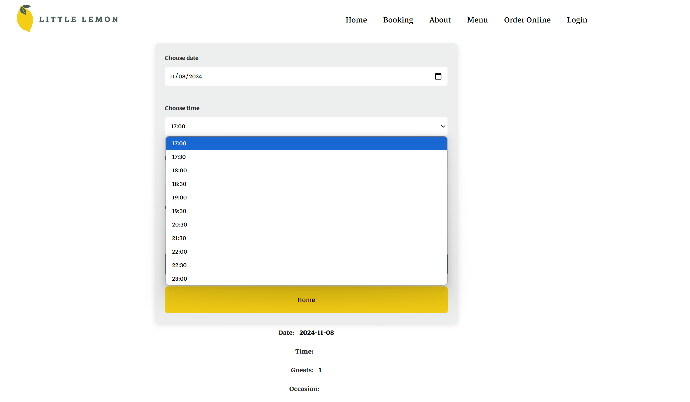
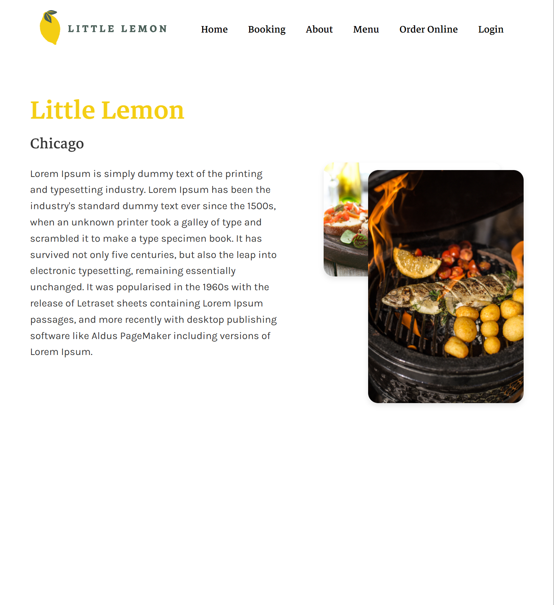

# 🍋 Little Lemon

**Little Lemon** is a restaurant reservation app created as part of the **Meta Front-End Developer Capstone** course.
This project uses React to provide a modern, interactive interface for managing and scheduling reservations in an
intuitive way.

## ✨ Key Features

- **Dynamic Reservation Form**: Allows users to select date and time slots, with automatic updates based on
  availability.
- **Smooth Navigation**: Dedicated pages for reservations and informational sections.
- **Responsive Design**: Optimized for both mobile and desktop experiences.

## ⚛️ Tech Stack

- **React**: For efficient state management.
- **React Router**: For page navigation.
- **CSS Modules**: For modular and customized styling.

## 🏆 About

This project was developed as part of the Meta Front-End Developer Capstone course, offering an opportunity to apply
advanced React concepts, state management, and interface design. **Little Lemon** is an example of an interactive
application that provides users with a quick and intuitive way to make reservations.

## 💡 Getting Started

1. **Clone the repository:**
   ```bash
   git clone https://github.com/claudiu28/Little-Lemon.git
    ```
2. **Open project directory:**
   ```bash
   cd Little-Lemon
   ```
3. **Install dependencies:**
   ```bash
   npm install
   ```
4. **Run the application:**
   ```bash
   npm start
   ```
5. **Project run at: http://localhost:3000**

## 🖼️ Screenshots






